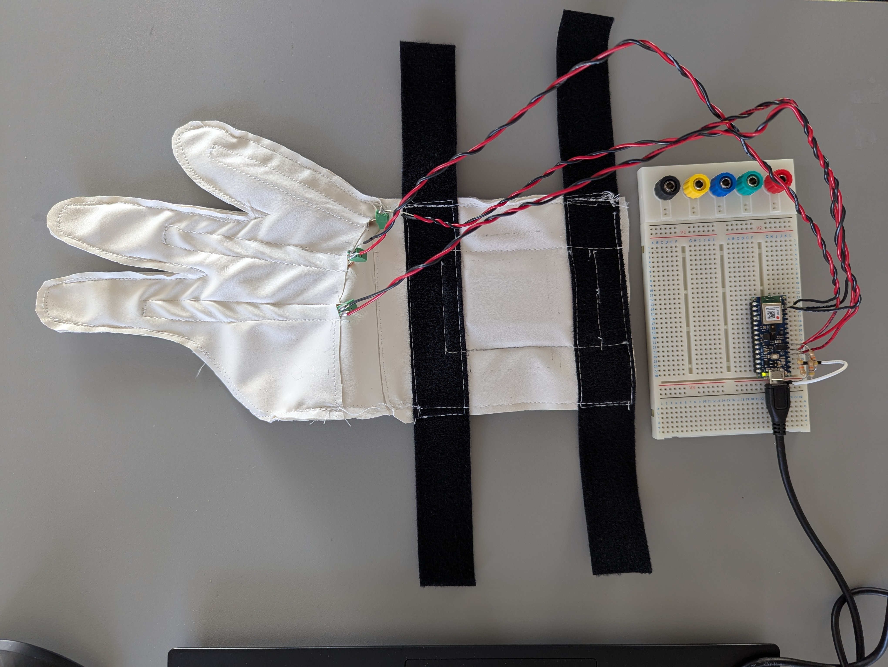
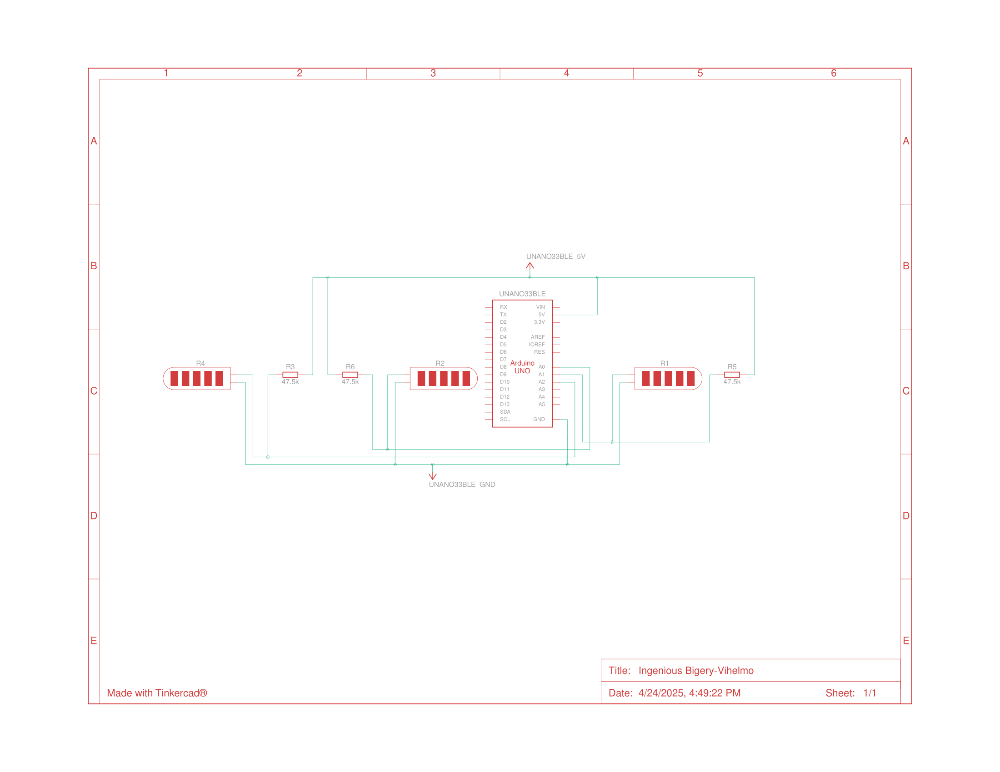
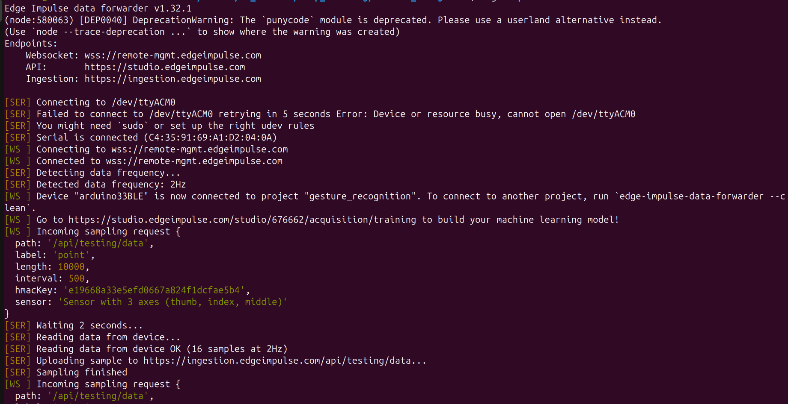

# Gesture Recognizer

Click here to see the project on [EdgeImpulse](https://studio.edgeimpulse.com/public/676662/live).

A deep learning project that uses Edge Impulse to train a model to learn equating specific movement to a specific output.

## Setup

> Note: Make sure you have the `edgeImpulse CLI` installed. You can find installation instructions [here](https://docs.edgeimpulse.com/docs/tools/edge-impulse-cli/cli-installation).
>
> This project uses the `edge-impulse-data-forwarder` tool.

### Components Used

| component name | how many | link |
|----------------|----------|------|
| Arduino Nano 33 BLE | 1 | |
| 47.5k Resistor | 3 | |
| Flex sensors | 3 | [sparkFun](https://www.sparkfun.com/flex-sensor-2-2.html) |
| PCB Terminal Block | 3 | [RS Pro](https://uk.rs-online.com/web/p/pcb-terminal-blocks/7901098) |

### Hardware

I used this [hookup guide](https://learn.sparkfun.com/tutorials/flex-sensor-hookup-guide/all) by SparkFun to setup my system. 

> Note: They wired it to the 5v line, but one issue I had was 5v was not being output by my Arduino. This is likely because I was powering my Arduino from my laptop. 3.3v works fine with pull-up resistors, rather than pull-down resisors.

It looks like this:

My wiring diagram is below.

#### Architecture Diagram

### Software

Open the [arduino script](./data_reader/data_reader.ino), and push the code to the device. I opened my serial port to verify that the values were being output correctly.

I opened my terminal, and ran `edge-impulse-data-forwarder`. Then closed my serial port in Arduino IDE.

.

When first running the data forwarder, be aware you must create the device and link to it in the edgeImpulse website. 

## How to Run

By clicking on the Edge Impulse link above, it will take you to the pre-made project. If you click `Model Testing` in the left bar, you can run tests with a connected device. Otherwise clicking on the `Deployment` option allows you to use this model in your projects.

## Training

I've found the best way to train the data is to set the sample time to a higher value like 10 seconds. Slowly complete the movement desired. Then clicking the `3 dots` beside the dataset, you can `split the sample`. From here you can rapidly create several data samples for the model to read. 